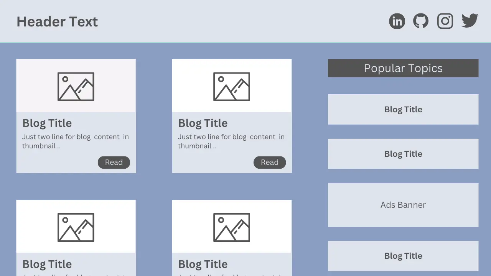

<h1>Blog Page</h1>

Welcome to my <a href="https://askaf11.github.io/Blog-Page/">Blog Page </a>repository! This project is dedicated to sharing my thoughts, experiences, and knowledge on various topics. It serves as a platform for me to express my ideas and connect with readers interested in similar subjects.

<h2>Features</h2>
<ul>
  <li align="justify"><b>Home Page: </b>Overview of recent posts and highlighted articles.</li>
  <li align="justify"><b>Categories: </b>Organize posts into different categories for easy navigation.</li>
  <li align="justify"><b>Post Pages: </b>Detailed view of each blog post with comments section.</li>
   <li align="justify"><b>Footer: </b> Contains social media links and additional information about you.</li>
</ul>

<h2>Technologies Used</h2>
<ul>
  <li align="justify"><b>HTML5:</b> For structuring the content on the web.</li>
  <li align="justify"><b>CSS3:</b> For styling and enhancing the appearance of the website.</li>
  <li align="justify"><b>Bootstrap 5:</b> For responsive layout and pre-designed components.</li>
</ul>
  
<h4 align="center">Blog Page Project | Created by <a href="https://askaf.in/" target="_blank">Askaf</a></h4>
